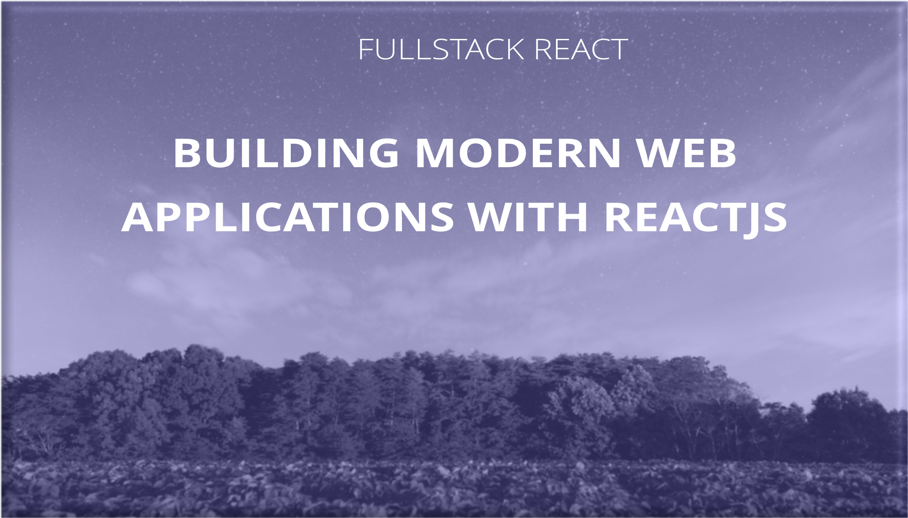
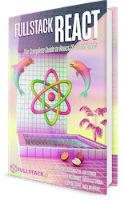

<p align="center">
  
</p>


## Fullstack React video course

Welcome to the video screencast on getting up and running with React to build modern front-end web applications. 

In this screencast, we're covering a lot of ground from zero to full running application. 

## Quickstart

### Run the back-end web server

```bash
cd movieBackend
```

Then install the dependencies and start the application:

```bash
yarn install
MOVIE_API_KEY=[YOUR KEY] yarn start
```


### Run the front-end web 

```bash
cd movieApp
```

Then install the dependencies and start the application:

```bash
yarn install
yarn start
```

You can now visit the server at [http://localhost:3000](http://localhost:3000). 

## What is this

This repo contains the complete source code for the [fullstackreact](https://fullstackreact.com) video course. Inside, you'll find the completed version of the app through all the chapters of what we build. In the course, we cover a wide range of topics focused on React, such as (but not limited to):

* Create React App
* Multiple types of React components
* Higher-order components
* Styling with PostCSS
* Dealing with EventSource and websocket push notifications
* Routing with React-router v4
* Fetching movies with authenticated requests
* Designing reusable components
* Dynamic routing
* Building star ratings with advanced CSS
* And much much more

## How this repo is organized

Inside, we also have the video courses included with the application source code. The `movie.tar.gz` file contains the front-end application is React, while the `movieBackend.tar.gz` contains the back-end for the movie database, hosted at [https://fullstackmovies.com](https://fullstackmovies.com). 

To run the backend webserver, ensure you have a key from themoviedb.org, which can be fetched at [https://www.themoviedb.org/documentation/api](https://www.themoviedb.org/documentation/api). Export the key and run the backend with the following commands:

```javascript
yarn install
MOVIE_API_KEY=[YOUR KEY] yarn start
```

The `movie.tar.gz` contains the front-end source code and can be started with the instructions above. 

# Fullstack React Book

<a href="https://fullstackreact.com">

</a>

This Google Map React component library was built alongside the blog post [How to Write a Google Maps React Component](https://www.fullstackreact.com/articles/how-to-write-a-google-maps-react-component/).

This repo was written and is maintained by the [Fullstack React](https://fullstackreact.com) team. In the book we cover many more projects like this. We walk through each line of code, explain why it's there and how it works.

This app is only one of several apps we have in the book. If you're looking to learn React, there's no faster way than by spending a few hours with the Fullstack React book.

<div style="clear:both"></div>